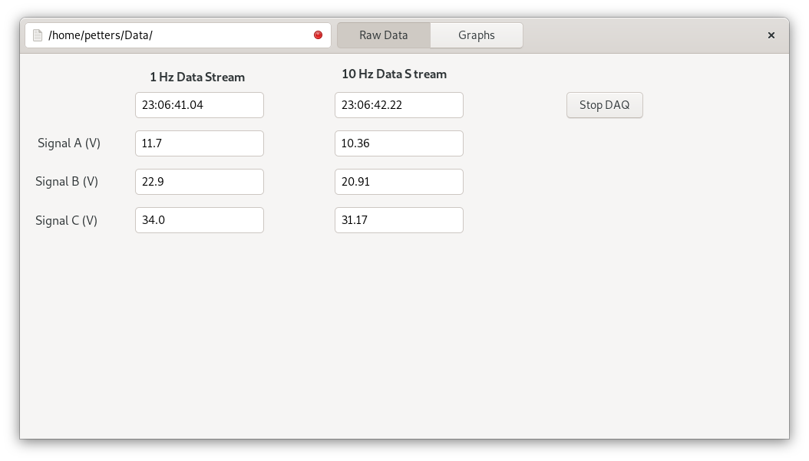

# Julia-AFRP-DataAcquisition

Concept implementation using julia for building data acquisition systems.

# Installation

Package
```julia
pkg> add https://github.com/mdpetters/Julia-AFRP-DataAcquisition.git
```

Dependencies

```julia
pkg> add Distributed Gtk InspectDR Reactive Colors DataFrames DataStructures Dates Interpolations Statistics Printf CSV NumericIO
```

# Brief Description

The GUI is created using glade (see gui.glade as example). 

The module DataAcquisitionLoops contains an example of timed concurrent data acquisition at 1 and 10 Hz. The data are stored in a circular buffer. Data are also written to an interpolated 1 Hz and 10 Hz regularly gridded structure. Raw data is written to file in the ~/Data directory

DataAcquistionLoops is executed on a separate core. This allows the program to perform high-load computation task on the main core (e.g. data processing), without affecting the critical timing of the DAQ loops. DataAquisition loops are polling synthetic data for demonstration. No hardware I/O is performed

Running main.jl in ther REPL will bring up the GUI and start the Acquisition loop. The REPL will be responsive while the program runs in the background. 

Examples are provided to generate a responsive graph (with dropdown selection of signals) and GUI textbox to display data. 

# Screenshots




# Related Projects
Implementation of SMPS data acquisition software using the same concepts

https://github.com/mdpetters/Julia-SMPS-IM

Julia driver for hardware data acquisition using the Labjack U6 multifunction DAQ device

https://github.com/mdpetters/LabjackU6Library.jl